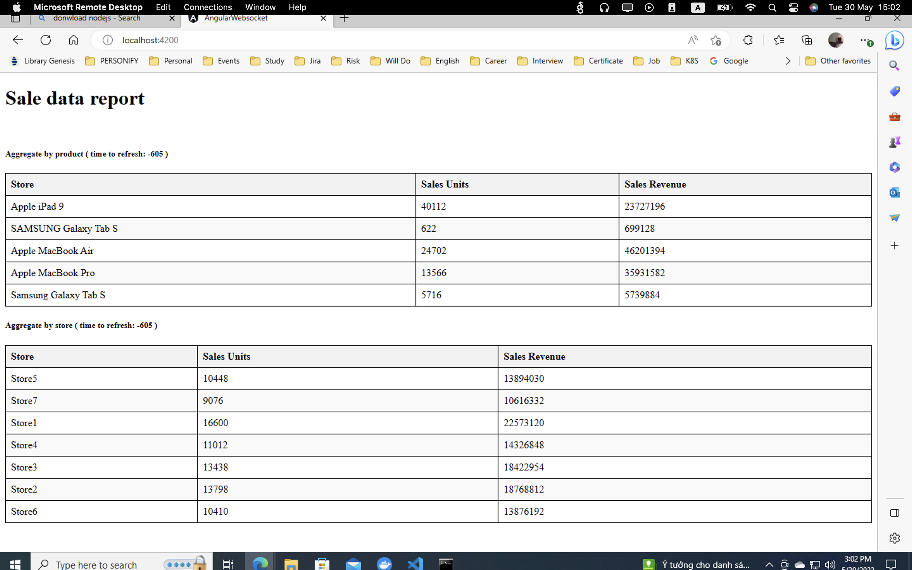
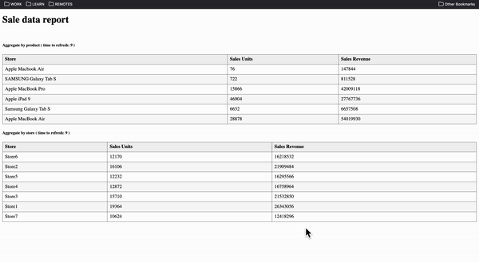

# Vnet DEMO

## 1. How to install this app


Open your terminal and run these commands:

```shell


# STEP 1: clone this repo
git clone https://github.com/kainguyen-dev/vnet-demo.git
cd vnet-demo

# STEP 2: Build backend

# if your computer is WINDOW:
    mvnw.cmd clean package
# if your computer is MAC:
    mvnw clean package

# STEP 3: Run backend
java -jar target/vnet-demo-0.0.1-SNAPSHOT.jar


# STEP 4: Build Front end 
# Open a new terminal and run 

cd ui
npm i

# STEP 5 Install angular CLI (if you already install please skip this)
npm install -g @angular/cli

# STEP 6 Run front end
ng serve

```

Open url at http://localhost:4200/ 
to see result:




## 2. Description

As the requirement describe: 

```
However, Tom's Boss is a difficult person and always changes requirements.

In the future, he can change or add more requirements such as: only aggregate by product, only aggregate by store or other requirements (not limited product and store fields). 

Therefore, you need to build the system to easily scale or modify when there is a new request from this difficult boss.
```

The main idea is to build a **KafkaStream** aggreate these value (product, store) that sastisfied Tom's boss requirement at **runtime**, there is no need to add new code when new requirement coming:

To do that we build an generic template for streams:

```yaml
    stream:
        aggragate-by-store:
            topic: SALE_REPORT_BY_STORE
            group-key: StoreName
            sum-field: SalesUnits, SalesRevenue
            log: false
        aggragate-by-product:
            topic: SALE_REPORT_BY_PRODUCT
            group-key: ProductName
            sum-field: SalesUnits, SalesRevenue
            log: false

```

And build them when the application start.

When browser open, a new web socket connection is establish and backend create a kafka consumer to listen for aggreate value of streaming topic and show to the users.

## 3. In actions

Below is the gif file record applicaion's data is updated without refresh the page

